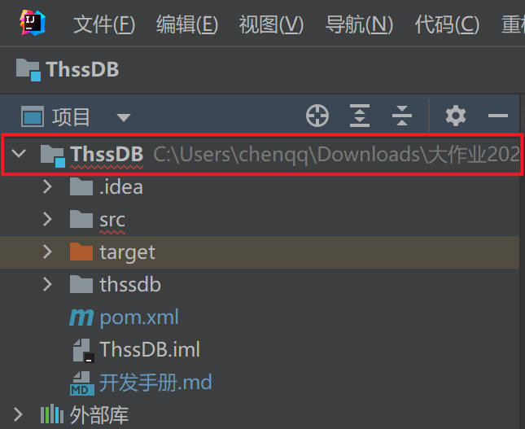

# ThssDB 开发手册

## 开发环境

操作系统：Windows，Linux，macOS

IDE：IntelliJ Idea

项目管理工具：Maven（配置在Idea中）

## 如何编译及运行（IDEA中自测，不保证 minimum 配置）

1. 配置 Java 环境（JDK，JRE）
2. 安装 Maven Helper
   1. 在 文件-设置-插件 中搜索 maven helper，并安装
3. 安装依赖项目(命令行：`mvn install dependency`)，IDEA 操作如下：
   1. 右键点击”项目“中的 ThssDB 
   2. 在 Run Maven 选项中选择 install 
4. 编译项目：
   1. 同 3，最后在 Run Maven 选项中选择 compile
5. 运行项目（项目分为 Server 和 Client 两个部分，需要分开运行）
   1. 运行 Server：`src/main/java/cn.edu.thssb/server/ThssDB.java` 中的 `main` 函数
   2. 运行 Client：`src/main/java/cn.edu.thssb/client/Client.java` 中的 `main` 函数

## 开发调试

服务端启动在server.ThssDB.main()处启动

客户端在client.Client.main()处启动

启动Client后，使用 `connect;` 语句连接Server，这里删除了用户及权限相关的逻辑，不需要走权限验证即可直接连接到Server，感兴趣的同学也可以把用户相关的逻辑自己实现一下。

连接成功后，可以输入SQL语句进行执行，ThssDB使用标准的SQL语法。

断开连接使用 `disconnect;`

## 关于 ThssDB 的架构 - RPC 与 Thrift

参见 [这篇文章](https://notes.cqqqwq.com/programming/thrift/)，阅读这篇文章可以理解整个 ThssDB 系统的底层架构，理解在写项目什么位置的代码。

### 任务目标

这一部分明确具体的任务目标以及如何实现。

需要在查询（query/parser 模块）、事务（schema模块）补充完善代码，具体需要更改的类包括：parser/ImpVisitor，query/QueryResult, query/QueryTable, schema/Table, schema/Database, schema/Manager.

ThssDB代码框架仅作为参考，可根据需要增加模块和类，鼓励进行系统架构创新与代码重构。

### 任务一：实现十类 SQL 语句

* 创建数据库

  `CREATE DATABASE NAME;`

* 建表

  `CREATE TABLE tableName(attr1 type1, attr2 type2, attr3 type3 NOT NULL, PRIMARY KEY(attr1));`

  实现“NOT NULL”和“PRIMARY KEY”这两个关键字，Type为Int，Long，Float，Double，String（必须给出长度）之一。

* 使用数据库

  `USE databaseName;`

* 插入

  `INSERT INTO tableName values(value1, value2, value3);`

  `INSERT INTO tableName(attr1, attr2) values(value1, value2);`

* 查询

  `SELECT column1 FROM table1;`

  `SELECT column1, column2 FROM table1, table2 WHERE attr1=value1;`

  `SELECT table1.column1, table2.column2 FROM table1, table2 WHERE table1.attr1=table2.attr1`

  上述语句中，Where子句仅包含一个比较运算，具体为‘<’、‘>’、‘<=’、‘>=’、‘=’、‘<>’。From子句中涉及2张表，On子句的限制与Where子句相同。DML语句中不包括嵌套语句。

* 删除

  `DELETE FROM table1;`

  `DELETE FROM table1 WHERE attr1=value1;`

* 修改

  `UPDATE tableName SET attr1=value1;`

  `UPDATE tableName SET attr1=value1 WHERE attr2=value2;`

* 展示表

  `SHOW TABLE tableName;`

  `SHOW TABLES;`

* 删除表

  `DROP TABLE tableName;`

* 删除数据库

  `DROP DATABASE databaseName`

进阶项：

1. 应用课程中介绍的查询优化技术
2. 支持多列主键；
3. where条件支持逻辑运算符（and/or）；
4. 实现三张表以上的join；
5. 实现outer join等其他类型的join；
6. 其他标准SQL支持的查询语法。

实现方法（估测）：

这一部分主要是在 Server 端处理，确定操作方法后给 Handler 加功能？

然后可能要先 Parse，然后对 BPlusTree 的 Index 进行操作，并且修改数据库本身（在 `schema/Database` 里面）。

这一部分在 Client 没有工作

### 任务二：事务并发与恢复模块

实现简单的事务及恢复功能，支持小规模的并发。

基础要求：

1. 实现 begin transaction 和 commit ；采用普通锁协议，实现 read committed 隔离级别；在报告中通过实例说明隔离的有效性。
schema/Table 类、schema/Database 类、schema/Manager 类包含属于不同数据层次的 insert/delete/update 等基础操作，需要在这些操作中支持事务，对于实现中额外添加的数据操作函数，也需要添加必要的事务处理。已给出程序框架，请完成剩余部分（可以参照 schema/Manager.quit 函数的锁设置方法）。

2. 实现事务的 WAL 机制，要求实现写 log 和读 log ，在重启时能够恢复记录的数据即可。
在 schema/Manager.writeLog 函数中已给出写 log 的方法，请补充读 Log 方法。

进阶项：

1. 实现多事务的并发和恢复机制；
2. 实现更高级的隔离级别（repeatable read/serializable）；
3. 实现 rollback、savepoint 等功能。
4. 实现 MVCC 协议。

#### 实现方法：

1. 实现 Read Committed 的锁方法：

ReentrantReadWriteLock 类是 Java 默认的读写锁，拥有一个读锁 `.readLock()` 和一个写锁 `.writeLock()`。

为了实现 Read Committed 隔离级别，我们对于所有的读操作和写操作都加上对应的锁。对于读操作，在读过后就释放读锁；对于写操作，在 Commit 之后才释放写锁。

对于加锁的粒度是加在表（Table）上。数据库只有 SELECT 是读操作，其他操作都是写操作。当一个操作进入 Table 类的具体的函数，对表进行加锁操作；调用 table 的函数之前，也要进行锁状态的检查。

为了便于管理锁，新建了 schema/LockManager.java 类，用于管理一个 Database 里面所有可能的锁。【这里目前还没有和操作耦合起来】

2. 从日志恢复的模块

日志的处理单独构建了一个类：Logger 类。每一个 Database 会绑定一个 Logger 类的实例、

这个 Logger 类并不会参与数据库的恢复，只是一个读/写 Log 工具。

Log 的写是在 SQLHandler 类的 Evaluate 函数的开头，调用数据库的 Logger 完成操作。

从 Log 恢复到数据库是在 Manager 类里面的 LogRecover 函数。这个函数被 Manager 的 Recover 函数调用，调用 Logger 读入 Log 之后，再一行行地调用 SQLHandler 的 Evaluate 函数恢复。

【但我其实不太理解...
1. 在 Table 的 Recover 函数（也就是 Manager -> Database -> Table 的 Recover一路调用下去）中，是有从磁盘中的文件恢复到 table 的，那这里再从 log 恢复什么呢？
】
