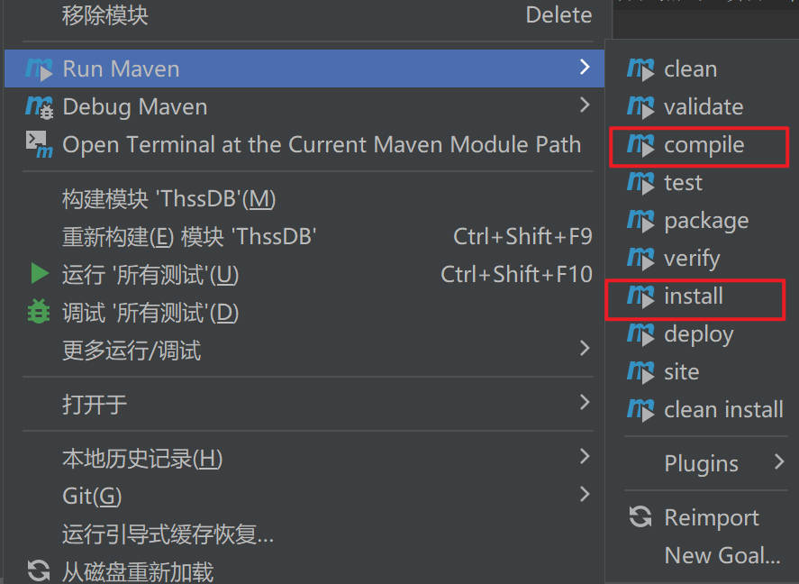

# 开发手册

### 开发环境

操作系统：Windows，Linux，macOS

IDE：IntelliJ Idea

项目管理工具：Maven（配置在Idea中）

### 如何编译及运行（IDEA中自测，不保证 minimum 配置）

1. 配置 Java 环境（JDK，JRE）
2. 安装 Maven Helper
   1. 在 文件-设置-插件 中搜索 maven helper，并安装
3. 安装依赖项目(命令行：`mvn install dependency`)，IDEA 操作如下：
   1. 右键点击”项目“中的 ThssDB 
   2. 在 Run Maven 选项中选择 install 
4. 编译项目：
   1. 同 3，最后在 Run Maven 选项中选择 compile
5. 运行项目（项目分为 Server 和 Client 两个部分，需要分开运行）
   1. 运行 Server：`src/main/java/cn.edu.thssb/server/ThssDB.java` 中的 `main` 函数
   2. 运行 Client：`src/main/java/cn.edu.thssb/client/Client.java` 中的 `main` 函数

### 开发调试

服务端启动在server.ThssDB.main()处启动

客户端在client.Client.main()处启动

启动Client后，使用 `connect;` 语句连接Server，这里删除了用户及权限相关的逻辑，不需要走权限验证即可直接连接到Server，感兴趣的同学也可以把用户相关的逻辑自己实现一下。

连接成功后，可以输入SQL语句进行执行，ThssDB使用标准的SQL语法。

断开连接使用 `disconnect;`

### 需要实现的十类SQL语句

* 创建数据库

  `CREATE DATABASE NAME;`

* 建表

  `CREATE TABLE tableName(attr1 type1, attr2 type2, attr3 type3 NOT NULL, PRIMARY KEY(attr1));`

* 使用数据库

  `USE databaseName;`

* 插入

  `INSERT INTO tableName values(value1, value2, value3);`

  `INSERT INTO tableName(attr1, attr2) values(value1, value2);`

* 查询

  `SELECT column1 FROM table1;`

  `SELECT column1, column2 FROM table1, table2 WHERE attr1=value1;`

  `SELECT table1.column1, table2.column2 FROM table1, table2 WHERE table1.attr1=table2.attr1`

* 删除

  `DELETE FROM table1;`

  `DELETE FROM table1 WHERE attr1=value1;`

* 修改

  `UPDATE tableName SET attr1=value1;`

  `UPDATE tableName SET attr1=value1 WHERE attr2=value2;`

* 展示表

  `SHOW TABLE tableName;`

  `SHOW TABLES;`

* 删除表

  `DROP TABLE tableName;`

* 删除数据库

  `DROP DATABASE databaseName`
