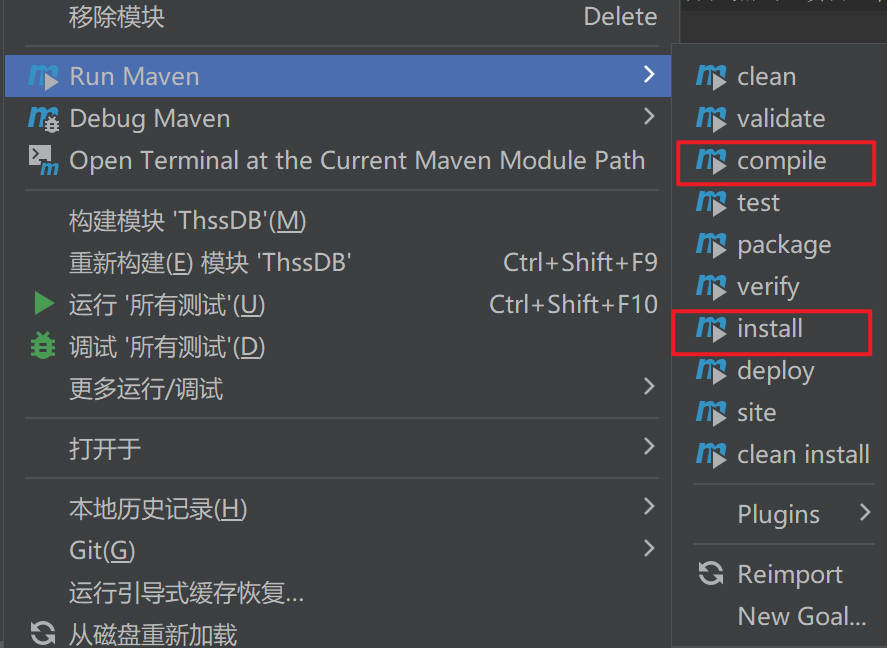

# ThssDB 用户手册

软件03 陈启乾 2020012385

软件02 潘首安 2019010575

软件93 孟德华 2019013289

## 开发环境

操作系统：Windows，Linux，macOS

IDE：IntelliJ Idea

项目管理工具：Maven（配置在Idea中）

## 如何编译及运行

1. 配置 Java 环境（JDK，JRE）

2. 安装 Maven Helper
   1. 在 文件-设置-插件 中搜索 maven helper，并安装
   
3. 安装依赖项目(命令行：`mvn install dependency`)，IDEA 操作如下：
   1. 右键点击”项目“中的 ThssDB
   
       
   
   2. 在 Run Maven 选项中选择 install
   
       
   
4. 编译项目：
   1. 同 3，最后在 Run Maven 选项中选择 compile
   
5. 运行项目（项目分为 Server 和 Client 两个部分，需要分开运行）
   1. 运行 Server：`src/main/java/cn.edu.thssb/server/ThssDB.java` 中的 `main` 函数
   2. 运行 Client：`src/main/java/cn.edu.thssb/client/Client.java` 中的 `main` 函数


## 客户端连接与断开

- 启动Client后，使用 `connect;` 语句连接Server。连接成功后，可以输入SQL语句进行执行，ThssDB使用标准的SQL语法。

- 断开连接使用 `disconnect;`


## SQL语句执行

ThssDB 提供了 `Bank` 和 `university` 两个示例数据库，用户可以通过其中的数据进行测试，也可自己新建数据库。目前支持的 SQL 语句及其示例如下：

### 展示数据库

```SQL
SHOW DATABASES
```

### 创建数据库

```sql
CREATE DATABASE database_name
```

### 删除数据库

```sql
DROP DATABASE database_name
```

### 切换数据库

```sql
USE database_name
```

### 展示数据库的所有表

```sql
SHOW DATABASE database_name
```

### 创建表

```SQL
CREATE TABLE tableName(attrName1 Type1, attrName2 Type2,…, attrNameN TypeN NOT NULL, PRIMARY KEY(attrName1)) 
```

实现“NOT NULL”和“PRIMARY KEY”这两个关键字，Type为Int，Long，Float，Double，String（必须给出长度）之一。

### 删除表

```SQL
DROP TABLE tableName 
```

### 展示表（元数据）

```SQL
SHOW TABLE tableName
```

### 插入数据

```SQL
INSERT INTO tableName VALUES (attrValue1, attrValue2,…, attrValueN)
INSERT INTO tableName(attr1, attr2) values(value1, value2)
```

- 字符串需要用单引号包围。
- Insert_into 的特性同 mysql 一致，具体如下：
  - `attr` 的顺序可以不与表格的顺序一致；
  - `attr`可以不包含所有列，默认填充为 `null`。但标定为 `not null` 的列必须填入
  - 不输入 `attr` 时，`value`的数量必须与列保持一致，空的列必须显式填充 `null`

### 更新数据

```SQL
UPDATE tableName SET attrName = attrValue [WHERE attrName1 = attrValue1 [and attrName2 = attrvalue2...]] 
```

- where 子句中每个条件仅包含一个比较运算，具体为`<`、`>`、`<=`、`>=`、`=`、`<>`
- 支持使用任意多个 `and` 和 `or` 进行复合条件判断
- 可以不包含 where 子句，默认更新表中所有的列

### 删除数据

```sql
DELETE FROM tableName WHERE attrName1 = attrValue1 [and attrName2 = attrvalue2...]
```

- `Delete` 语句必须包含 where 子句

### 查询数据

```sql
SELECT column1 FROM table1;
SELECT column1, column2 FROM table1, table2 WHERE attr1=value1;
SELECT table1.column1, table2.column2 FROM table1 Join table2 ON table1.attr1 = table2.attr1 WHERE table1.attr2 = attrValue2
```

- 使用 Join 语句时，必须包含条件 (On 子句)

- 支持三个表以上进行 Join，但由于不支持换名，Join 的表必须不同
- 使用 Join 连接表后，在 Select 项和 where 子句必须使用完整列名(tableName.attrName)

- 可以不包含 where 子句

## 事务相关语句

```sql
begin transaction;
```

开始一个事务。

```sql
commit;
```

提交一个事务。

只有 Read Committed 的事务隔离级别，默认开启。
